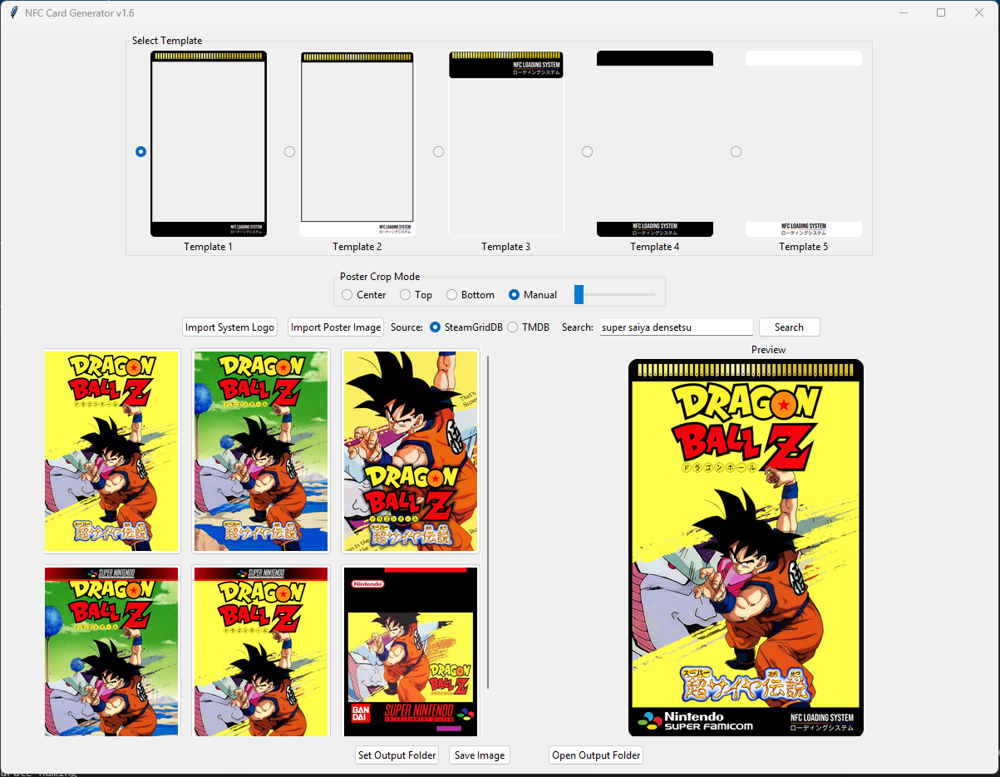
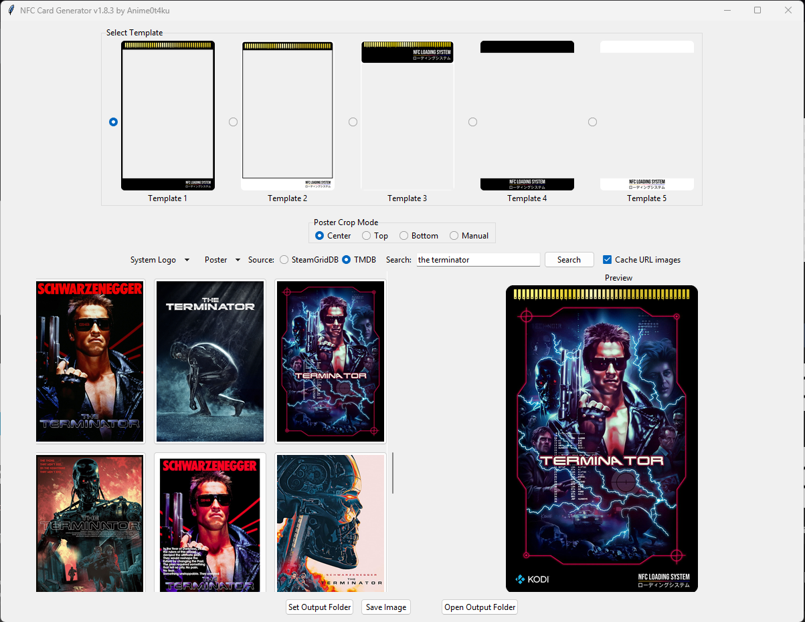

# NFC Card Generator

**nfc-card-generator.py** is a Python-based GUI application for generating **print-ready NFC card artwork** using predefined visual templates.  
It supports **games, movies, and TV shows**, allowing you to search for official or community artwork and generate consistent card images with minimal manual adjustment.

The tool is designed around repeatability and ease of use, making it ideal for physical NFC card projects, retro collections, and media-based launch or display systems.

---

## Screenshots

*Example showing games.*

*Example showing movies.*

---
## Features

### General
- Desktop GUI built with Tkinter
- Live preview of the generated card
- Automatic artwork scaling while preserving aspect ratio
- Template-aware image placement with fixed clear areas
- Manual crop adjustment when needed
- Persistent settings stored in `config.json`

---

### Game Artwork (SteamGridDB)
- Search and select games via SteamGridDB
- Multiple community-created posters per game
- Vertical poster filtering
- Asynchronous image loading with no UI freezing

---

### Movie & TV Artwork (TMDB)
- Unified search for **movies and TV shows**
- Official posters retrieved directly from TMDB
- Displays **all available poster variants** per title
- English posters preferred with automatic fallback
- Automatic release year detection for accurate naming

---

### Unified Search Workflow
- Single search bar for all content types
- Source selector for SteamGridDB or TMDB
- Title picker dialog for search results
- Shared thumbnail grid for all artwork sources

---

### Templates & Rendering
- Supports multiple predefined base templates
- Framed and layered layout styles
- Header and footer logo placement
- Automatic logo scaling and alignment
- Template previews shown directly in the UI

---

### Local Image Support
- Import custom poster images from disk
- Automatic orientation detection (horizontal / vertical)
- Works without any API usage
- Suitable for fan art or custom designs

---

### Output & File Handling
- Configurable output directory
- Automatic saving to the selected output folder
- One-click access to the output folder
- Timestamped filenames to prevent overwrites
- Movie and TV titles include release year in filenames

---

### API Key Management
- SteamGridDB and TMDB API keys stored locally
- Keys requested only when required
- Separate handling per service
- No hardcoded credentials

---

## Base Templates

The application currently includes **five base templates**, each with its own layout and visual style.  
Templates are designed with fixed clear areas to ensure correct artwork placement and consistent results.

---

## Included Assets

This repository includes a **system logo pack** containing commonly used platform and console logos.

These logos are intended to be used directly with the included templates and are positioned automatically to match each template’s layout.

---

## Requirements

- Python 3.9 or newer
- Pillow
- Requests
- SteamGridDB API key (for game artwork)
- TMDB API key (for movie and TV artwork)

---

## API Keys

### SteamGridDB
Used for searching and retrieving game artwork.

1. Create an account at https://www.steamgriddb.com
2. Open your account settings
3. Generate a personal API key

---

### TMDB (The Movie Database)
Used for searching and retrieving movie and TV posters.

1. Create an account at https://www.themoviedb.org
2. Go to **Settings → API**
3. Generate an API key

API keys are requested by the application when needed and stored locally.

---

## Tkinter (Linux Users)

On some Linux distributions, **Tkinter is not installed by default** and must be installed manually.

Required package:

    python3-pillow-tk

If Tkinter is missing, the application will fail to launch.

---

## Installation

### Clone the repository

    git clone https://github.com/yourusername/nfc-card-generator.git
    cd nfc-card-generator

### Install dependencies

    pip install pillow requests

### Run the application

    python nfc-card-generator.py

---

## Configuration

On first launch, the application automatically creates a `config.json` file.

Stored settings include:
- Output directory
- SteamGridDB API key
- TMDB API key

These settings persist between sessions.

---

## Output Folder Behavior

- When an output folder is set, generated images are saved automatically
- No save dialog is shown during normal operation
- A confirmation message appears after saving and disappears after a few seconds
- A **Open Output Folder** button becomes available once a folder is configured

---

## Notes

- Images always maintain their original aspect ratio
- Template clear areas are respected to avoid unwanted cropping
- The project is intended for personal and hobbyist use

---

## License

This project is released under the MIT License.  
You are free to modify, distribute, and use it for personal or commercial projects.
