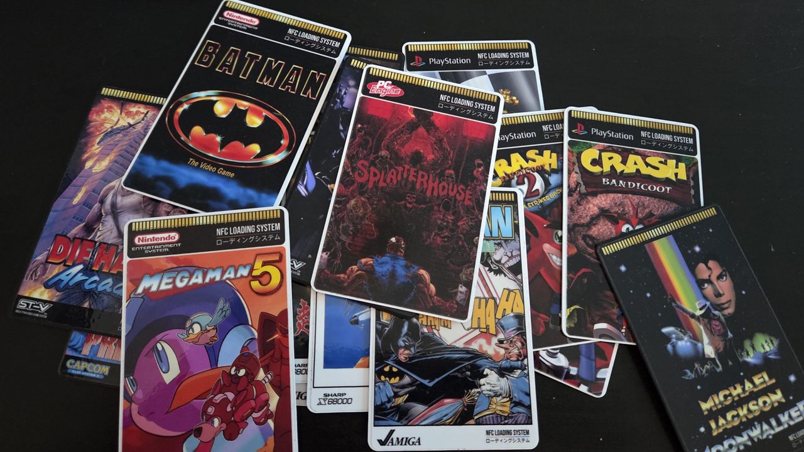
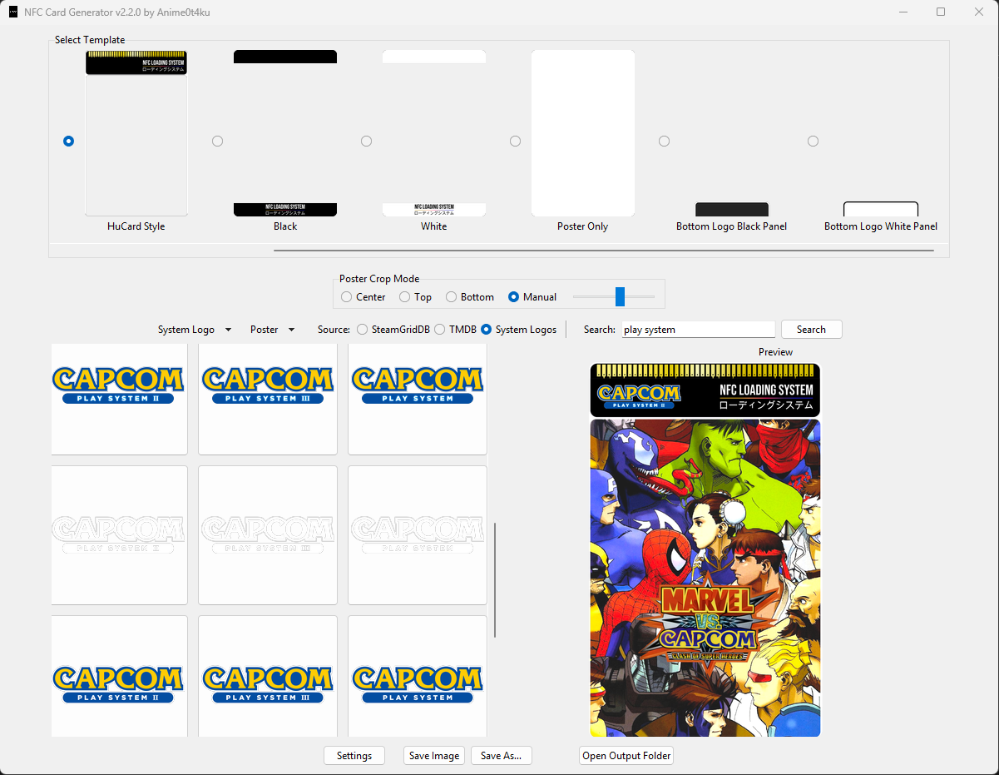
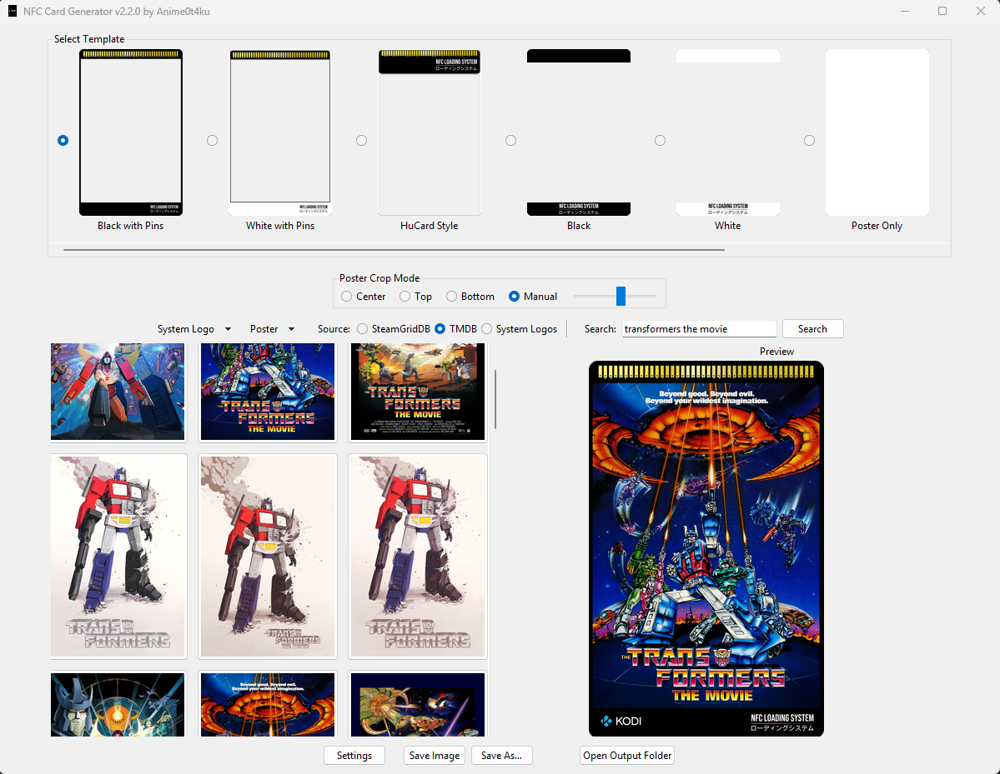

# NFC Card Generator

NFC Card Generator is a desktop application for creating **print-ready NFC card artwork** using predefined visual templates.

It supports **games (SteamGridDB)** and **movies / TV shows (TMDB)**, allowing you to search, preview, and generate consistent card artwork with minimal manual adjustment.

Designed for physical NFC projects, retro collections, and media launch systems.



---

## Download

Pre-built executables are available for Windows and Linux.

### Nightly Builds

| Name | Platform | Status | File |
|------|----------|--------|------|
| NFC Card Generator | Windows | [![Build Status][Build]][Actions] | [Download Windows](https://github.com/Anime0t4ku/NFC-Card-Generator/releases/download/Pre-release/NFC-Card-Generator-Windows-x86_64.zip) |
| NFC Card Generator | Linux | [![Build Status][Build]][Actions] | [Download Linux](https://github.com/Anime0t4ku/NFC-Card-Generator/releases/download/Pre-release/NFC-Card-Generator-Linux-x86_64.tar.gz) |

[Actions]: https://github.com/Anime0t4ku/NFC-Card-Generator/actions/workflows/build.yml  
[Build]: https://github.com/Anime0t4ku/NFC-Card-Generator/actions/workflows/build.yml/badge.svg  

---

## Screenshots



*Example showing game artwork.*



*Example showing movie and TV artwork.*

---

## Features

- Desktop GUI built with Tkinter  
- Live card preview  
- Multiple predefined base templates  
- Automatic image scaling and positioning  
- Manual crop adjustment  
- Optional header or footer system logos  
- Unified search workflow  
- Persistent settings via `config.json`  

### Artwork Sources

**SteamGridDB**
- Game search and poster selection  
- Vertical poster filtering  

**TMDB**
- Unified movie and TV search  
- Official poster retrieval  
- Automatic release year detection  

### Poster & Logo Support

- Import posters from file or URL  
- Import system logos from file or URL  
- Optional logo usage  
- Automatic logo scaling per template  

### Output

- Configurable output directory  
- Timestamped filenames  
- One-click access to the output folder  
- Optional caching of URL images  

---

## Supported Platforms

### Windows
Pre-built executable provided.  
No Python installation required.

### Linux
Pre-built executable provided.  
No Python installation required.  
Requires a graphical environment (X11 or Wayland).

Run on Linux:

```bash
chmod +x NFC-Card-Generator
./nfc-card-generator
```

---

## Running From Source

Only required if you want to run or modify the script directly.

### Requirements

- Python 3.9+
- Pillow
- Requests
- Tkinter (may need manual install on some Linux distros)

Install dependencies:

```bash
pip install pillow requests
```

Run:

```bash
python nfc-card-generator.py
```

---

## API Keys

### SteamGridDB
Used for game artwork search.

1. Create an account at https://www.steamgriddb.com  
2. Generate a personal API key  

### TMDB
Used for movie and TV poster search.

1. Create an account at https://www.themoviedb.org  
2. Generate an API key  

API keys are requested by the application when needed and stored locally.

---

## License

This project is released under the MIT License.
